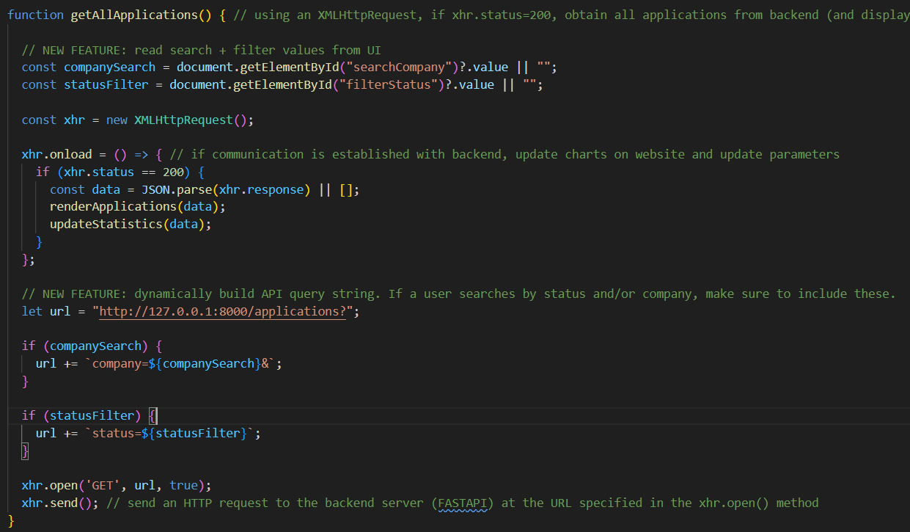
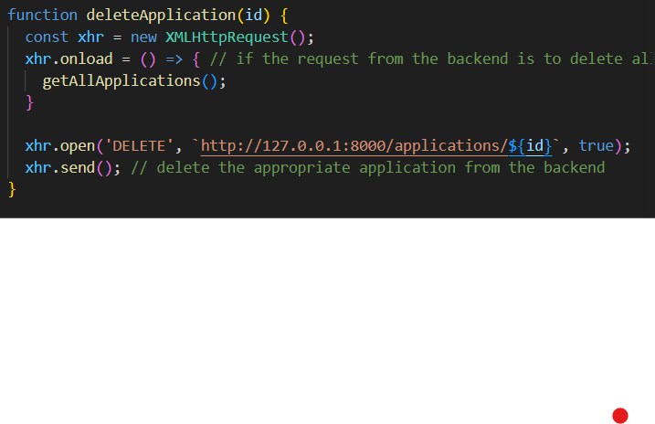
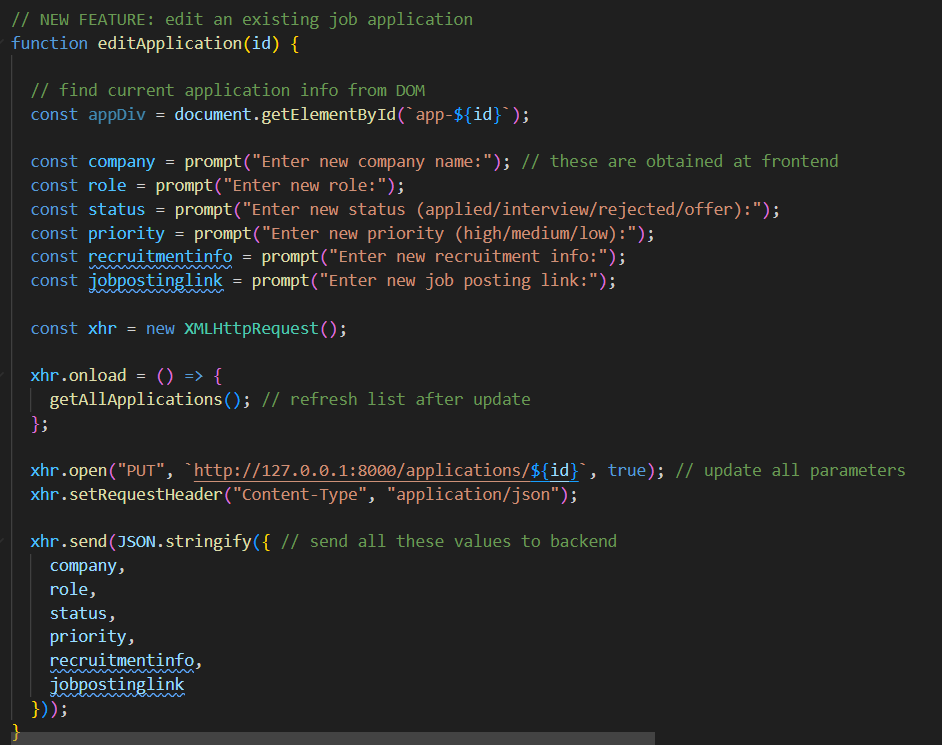
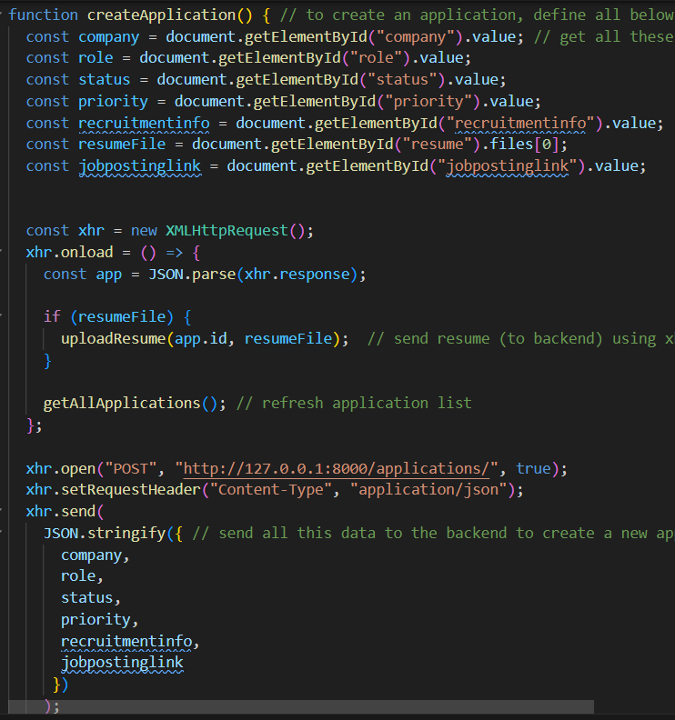
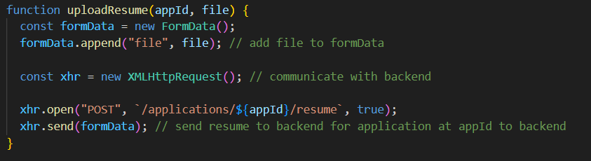
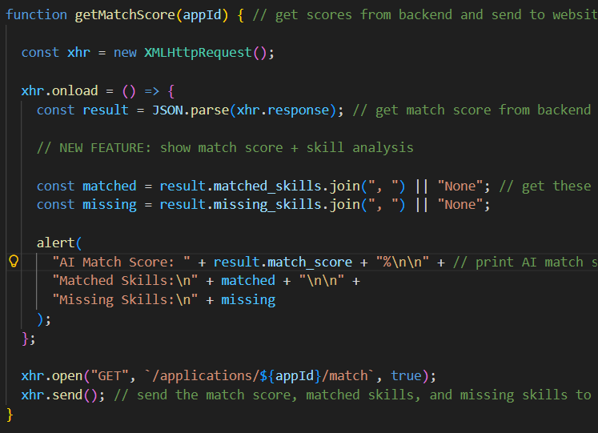
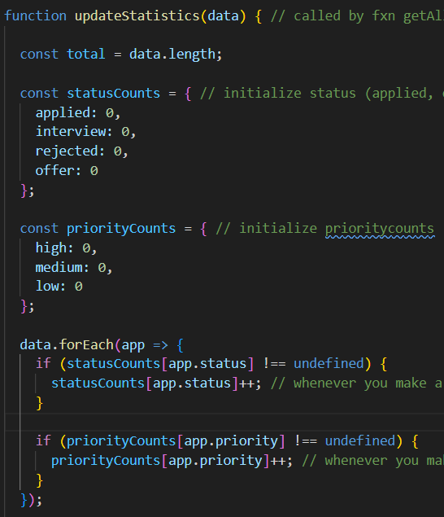
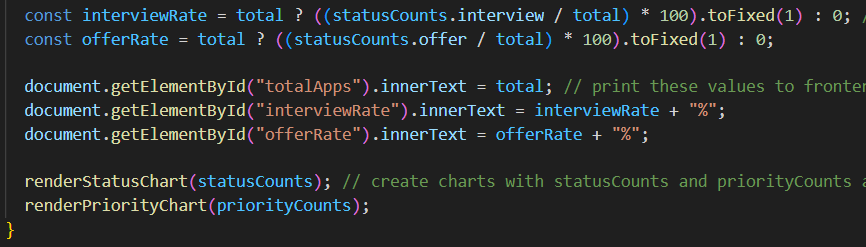

python -m venv venv
./venv/Script/activate
pip install pydantic
The main purpose of the assignment was to build a web app using FASTAPI and demonstrate use of get/post/put/delete (CRUD) methods. The get method on my frontend, getAllApplications(), first obtains the company and status the user wants to restrict the search to. Then it establishes communication with the backend using xhr. Render applications creates the appDiv.innerHTML link, and the values in it are obtained from the backend using a xhr GET request.

The deleteApplications(id) function also first stablishes communication with backend. Then, it creates a DELETE request for the application of the specific id. 

My editApplications(id) function (for frontend) prompts the user for new values of company, role, status, priority, recruitmentinfo, and jobpostinglink. Once communication is made with backend, the list is refreshed, and a PUT request updates the values of all these parameters. a JSON string of all these values is sent to the backend. Then, getAllApplications() is called once more to refresh them.

The createApplication() function creates a new application by first initializing new values for company, role, status, priority, recruitmentinfo, resumeFile, and jobpostinglink. Then, a post request is sent to the backend with all these new values.

I also have an uploadResume(appId, file) function, which first takes the resume (file) and adds it to a file formData. a POST method is then created for the application of appId, and the resume is sent to the backend using xhr.send.

On the frontend, I also have a getMatchScore(appId) function, which simply obtains the match score, matched skills, and missing skills from the backend and prints them to the frontend. 

Finally, on the frontend, I have a function updateStatistics which computes the interViewRate and offerRate, keeps track of status and priority counts, and calls 2 associated functions which print bar and pi charts to the screen. The bar graph shows the # of jobs in each status category (applied, interview, offer, rejected), and the pi chart shows the % of jobs in each priority (high, medium, low).

