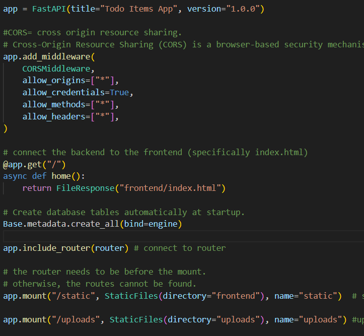
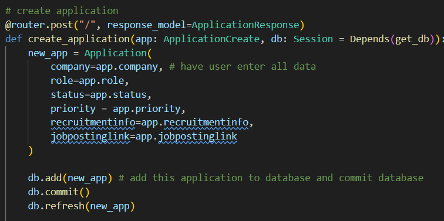
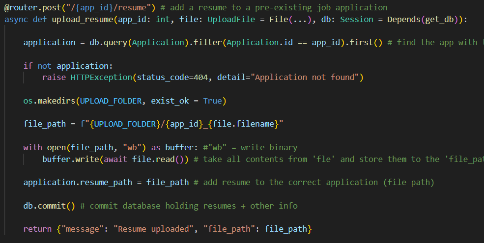
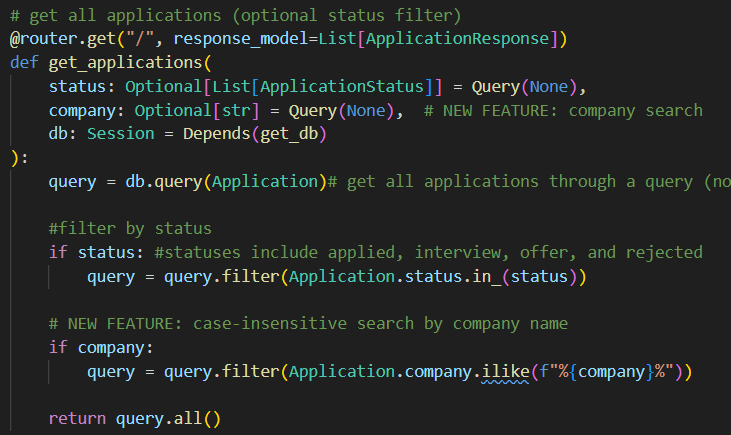
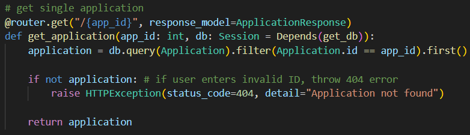
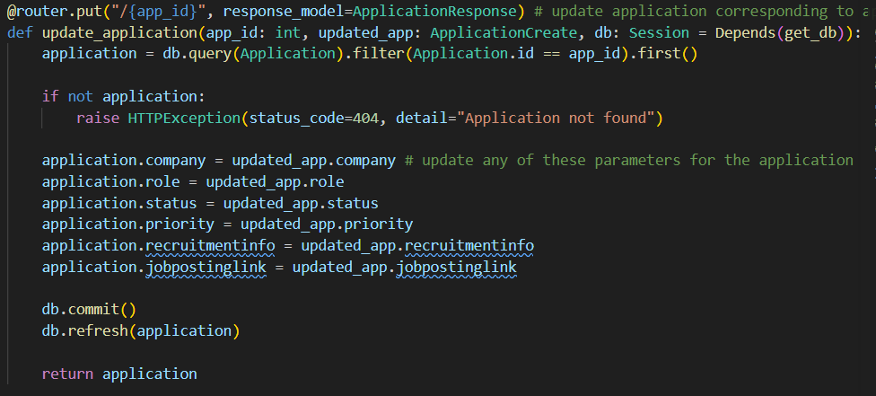
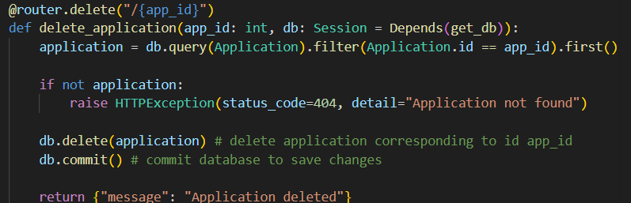
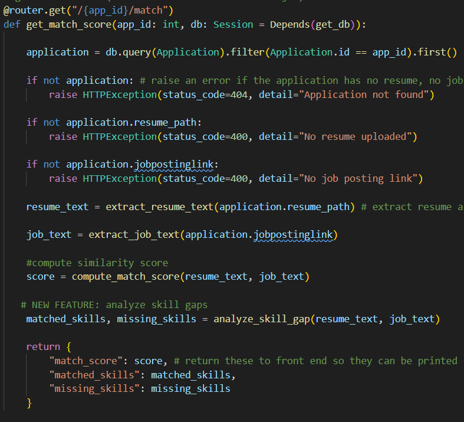

python -m venv venv
./venv/Script/activate
pip install pydantic
The main purpose of the assignment was to build a web app using FASTAPI and demonstrate use of get/post/put/delete (CRUD) methods. The get method on my frontend, getAllApplications(), first obtains the company and status the user wants to restrict the search to. Then it establishes communication with the backend using xhr. Render applications creates the appDiv.innerHTML link, and the values in it are obtained from the backend using a xhr GET request.

The deleteApplications(id) function also first stablishes communication with backend. Then, it creates a DELETE request for the application of the specific id. 

My editApplications(id) function (for frontend) prompts the user for new values of company, role, status, priority, recruitmentinfo, and jobpostinglink. Once communication is made with backend, the list is refreshed, and a PUT request updates the values of all these parameters. a JSON string of all these values is sent to the backend. Then, getAllApplications() is called once more to refresh them.

The createApplication() function creates a new application by first initializing new values for company, role, status, priority, recruitmentinfo, resumeFile, and jobpostinglink. Then, a post request is sent to the backend with all these new values.

I also have an uploadResume(appId, file) function, which first takes the resume (file) and adds it to a file formData. a POST method is then created for the application of appId, and the resume is sent to the backend using xhr.send.

On the frontend, I also have a getMatchScore(appId) function, which simply obtains the match score, matched skills, and missing skills from the backend and prints them to the frontend. 

Finally, on the frontend, I have a function updateStatistics which computes the interViewRate and offerRate, keeps track of status and priority counts, and calls 2 associated functions which print bar and pi charts to the screen. The bar graph shows the # of jobs in each status category (applied, interview, offer, rejected), and the pi chart shows the % of jobs in each priority (high, medium, low).

On my backend, my main.py file initializes the FastAPI app, initializes CORS settings, connects backend to the frontend, creates database tables, and connects to my router in routes.py (responsible for CRUD methods). It is important that I import UploadFile from fastapi, since my web app involves uploading resumes.

My routes.py file includes all CRUD methods for the backend. For instance, it includes a create_application() post ethod, which creates a new app using the parameters defined in models.py, adds them to the database, commits the database, refreshes the database, and returns the new application to the frontend.

It also includes a post function for a specific appid, which basically allows a user to attach a resume to a pre-existing job application. First, it queries the database to find the appropriate application. Then, a file path is made based off the file sent to the function. the contents from the file sent to the function are written (binary) to the file path. Then, the file path is attached to application.resume_path (a parameter defined in models.py). Finally, the database is committed, and a relevant 'success' message is returned.

Of course, in the backend I also have a get all applications method, and at first it obtains all apps in the database. However, it has special query options for status and company. For instance, if a user specifies that status=applied and company=Boeing, the search will only return applications for which the user applied to Boeing. The results of the query are returned.

The backend also has a get method that returns a single application when the user enters in an acceptable appid (an HTTPException is returned if the user enters an invalid id). The application is returned.

On the backend, thre is also a put (update) method. Basically, a specific app_id is queried, and the values of company, role, status, priority, recruitmentinfo, and jobpostinglink returned from the frontend are updated in the backend (using updated_app.__ values). The database is committed and refreshed.

The backend also includes a delete_application function, which basically operates the same as the delete_todo method used in class. It queries the DB for the application of id app_id, and then, upon finding it, deletes it from the database.

My routes.py backend also includes a get_Match_Score function, whcih returns the match_score, matched_skills, and missing_skills to the frontend. Many of the functions it uses, such as extract_resume/job_text, compute_match_score, and analyze_skill_gap, are defined in ai_matcher.py. The method first checks that the application being queried (of id app_id) exists, that it has a resume, and that it has a job posting. If so, the texts from the resume and job posting are extracted (with non-important info being removed), and the skills/similarities in the 2 texts in skills_DB are compared using compute_match_score. Then, the specific texts included in both texts and those included in just the job posting are determined using the analyze_skill_gap function. Finally, the overall AI score, matched_skills, and missing_skills are returned.
